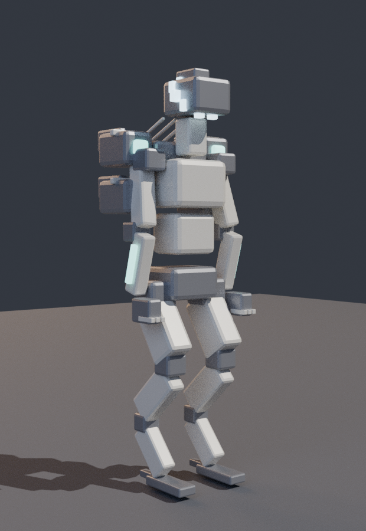

# STARFALL

A Destiny-style first-person looter-shooter for PC, built in Unity.

You play a **Choralith** — a colonial organism from the storm belt of a
tidally-locked world, which fights by taking itself apart. Shoot things, collect
better guns, raise your Power, and go back for harder things.



---

## Running it

You need **Unity 6** (6000.0 LTS or newer). It is free for personal use.

1. Install **Unity Hub** from <https://unity.com/download>.
2. In Unity Hub → *Installs* → *Install Editor*, pick **Unity 6000.0 LTS**.
   On the module screen, tick **Windows Build Support (IL2CPP)** if you want to
   produce a standalone `.exe` later.
3. In Unity Hub → *Projects* → *Add* → *Add project from disk*, and select the
   `StarfallUnity` folder in this repository.
4. Open the project. The first import takes a few minutes while Unity processes
   the models.
5. Open `Assets/Scenes/Starfall.unity` and press **Play**.

The scene is deliberately empty — the entire game builds itself from code at
startup, so there is nothing to wire up and nothing that can be left unassigned.
Pressing Play on *any* scene will start it.

### Building a standalone .exe

*File → Build Settings → Windows → Build*. Add `Assets/Scenes/Starfall.unity`
to the scene list if it is not already there, choose an output folder, and Unity
produces `Starfall.exe` plus its data folder.

---

## Controls

| | |
|---|---|
| **WASD** | Move |
| **Space** | **Disperse** — fragment and reform a short distance away (2 charges) |
| **Shift** | Sprint |
| **Ctrl / C** | Crouch, or slide out of a sprint |
| **Mouse 1 / 2** | Fire / aim |
| **R** | Reload |
| **1 2 3** | Kinetic / Energy / Power weapon |
| **Q** | Grenade |
| **E** | Melee |
| **F** | **Shed** — detach a facet that fights for you; press again to reabsorb it |
| **X** | Super |
| **Tab** | Character and inventory |
| **M** | Director (activity select) |
| **Esc** | Pause |

---

## The game

**Power** is the average level of your eight equipped pieces. Being under an
activity's recommended Power cuts your damage hard and raises theirs; being over
helps, up to a ceiling. Enemy health barely scales with the activity — the
*delta* is what carries the difficulty, so a red-bar dies to the same burst at
parity whether you are at Power 100 or 300.

**Loot** rolls rarity, stats and perks. Legendaries roll three perks from two
columns, and perks are real mechanics rather than flat numbers — Kill Clip only
pays out if you reload after a kill, Triple Tap returns a round on every third
precision hit, Surrounded reads the live enemy count. Eight exotic weapons carry
hand-authored traits, and ten exotic armor pieces change how the class plays.
You may equip one exotic weapon and one exotic armor piece at a time.

**Elemental shields** take triple damage from a matching element and almost
nothing from the wrong one, so what you bring matters.

### The Choralith

The class fantasy is *your body is a resource you spend*.

- **Shed** detaches a facet that fights autonomously and draws fire, at the cost
  of real maximum health. Reabsorbing it returns the health plus an overshield.
- **Disperse** replaces the jump: you come apart and reform, in air or on the
  ground.
- **Stilling** replaces death. Lethal damage instead suspends you — three
  seconds untouchable and helpless — and then you get back up. Long cooldown.
- **Polarised Sight** means you read motion and muzzle flash rather than colour,
  so anything that recently fired is visible whether or not you can see it.

Three subclasses: **Emberchoir** (*Pyre Chorus* — shed every facet at once as a
burning swarm), **Stormvoice** (*Chain Quorum* — a moving lattice of lightning),
**Deepstill** (*The Long Still* — full cryptobiosis while a null field drags
everything in and detonates).

### Activities

Two open patrol zones with beacons and roaming enemies, a three-hold strike
ending in a boss with immunity phases, and an Ordeal version of the strike at a
Power you have to earn, where dying ends the run.

---

## How it is built

Everything is generated. There are no purchased assets, no textures and no audio
files anywhere in the repository.

```
StarfallUnity/Assets/Scripts/Core/    engine-agnostic C# — no UnityEngine at all
StarfallUnity/Assets/Scripts/Game/    the Unity layer
StarfallUnity/Assets/Resources/Art/   FBX models, generated by Blender scripts
tools/blender/                        the scripts that generate those models
tools/core-tests/                     headless test suite for Core
tools/csharp-check/                   compile-check harness
web-prototype/                        the browser build the design came from
```

**Models** are authored by Python scripts running in Blender — see
[`assets-src/README.md`](assets-src/README.md). The scripts are the source of
truth; the FBX files are build products you can delete and regenerate. Characters
are rigged and carry the same five clips (Idle, Walk, Run, Attack, Death) so one
code path animates all of them.

**Audio** is synthesised as PCM at startup. Every weapon family, impact and UI
sound is rendered from oscillators and filtered noise in `AudioSynth.cs`.

**Levels** are generated from a seeded kit of structures — buildings with
doorways and walkable roofs, stepped ramps, towers, catwalks, crater rims,
debris fields. A zone is defined by a seed, so it lays out identically every
visit but differs from every other zone.

**Interface** is IMGUI, on purpose: no Canvas, no EventSystem, no prefabs, no
inspector references. It is swappable — everything visual goes through
`ArtLibrary`, which is the documented seam for dropping in real models,
materials and audio later.

---

## Development

```bash
./tools/csharp-check/check.sh     # compile every script against UnityEngine stubs
./tools/core-tests/run.sh         # 26 headless tests over the game logic
python3 tools/asset-check.py      # verify every referenced model exists

blender --background --python tools/blender/weapons.py     # regenerate weapons
blender --background --python tools/blender/enemies.py     # regenerate enemies
blender --background --python tools/blender/choralith.py   # regenerate the player
```

### A note on verification

Unity cannot be installed in the environment this was written in, so it has
never been run in the editor. To compensate:

- Every Unity script is compiled against hand-written `UnityEngine` API stubs.
  An API missing from the stubs is treated as a finding, not a nuisance — it
  means something was used that had not been deliberately checked.
- All the logic most likely to be wrong — loot generation, power curves, the
  perk pipeline, save round-tripping — lives in `Core`, which has no engine
  dependency and is genuinely executed by the test suite.
- Every model is rendered in Blender and reviewed as an image before shipping.

What that does **not** cover is how it feels to play: weapon handling, enemy
pacing, whether the Shed health cost is worth it. Those numbers were tuned in
the browser prototype under real playtesting and carried over, but they will
want another pass once you have played it.

The stubs constrain the code to C# 7.0, since that is what Mono's compiler
implements. Unity 6 permits C# 9, but staying inside 7.0 is what keeps the
compile check meaningful.
